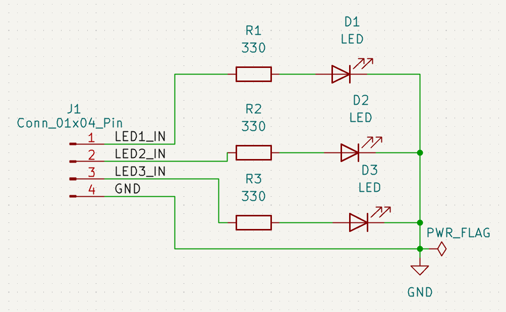
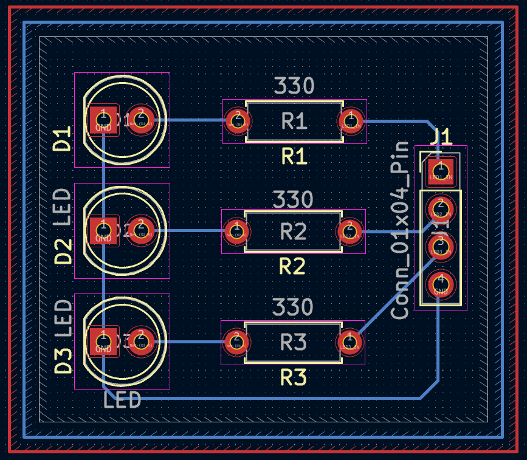
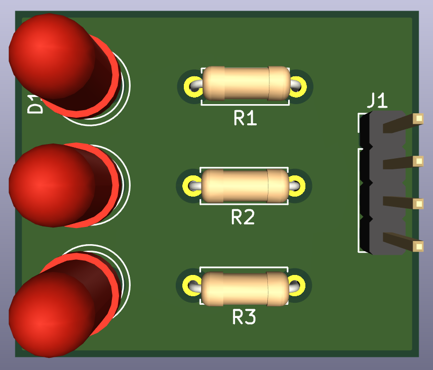
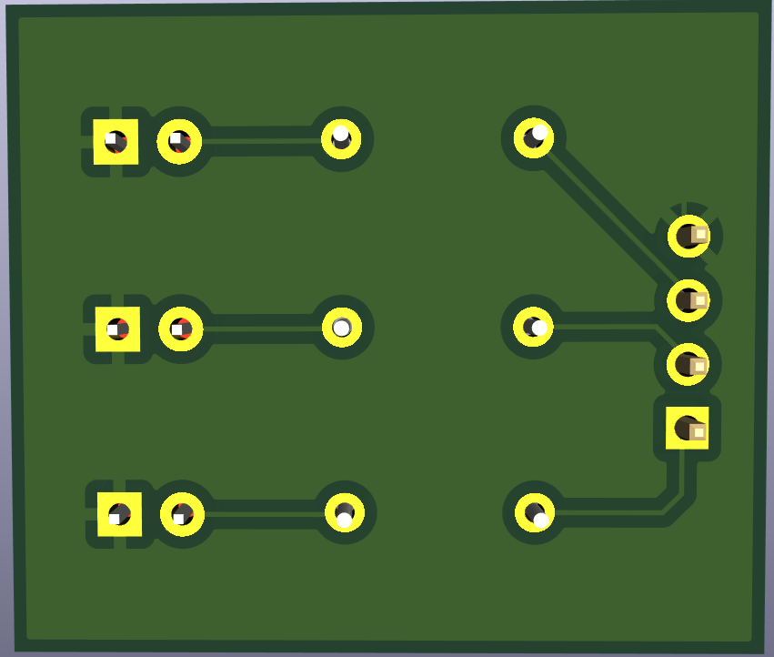

# 01 - Basic LED Board

A beginner-friendly PCB project designed in KiCad 9 to practice the full schematic-to-fabrication workflow — schematic capture, PCB layout, routing, and Gerber generation.

Part of my **PCB Design Learning Series**, where I design and document circuits from basic to advanced using KiCad.

## Software Used

Designed in **KiCad 9**

## Overview

A simple 3-channel LED indicator board. Each LED is driven through a dedicated 330 Ω current-limiting resistor, controlled independently via a 4-pin header (J1).

| J1 Pin | Signal   | Description              |
|--------|----------|---------------------------|
| 1      | LED1_IN  | Drives LED1 through R1    |
| 2      | LED2_IN  | Drives LED2 through R2    |
| 3      | LED3_IN  | Drives LED3 through R3    |
| 4      | GND      | Common ground             |

## Features

- Through-hole PCB, beginner-friendly assembly
- 3 independently controlled LED indicators
- 330 Ω current-limiting resistors on each channel
- ERC and DRC verified
- Gerber and drill files included, ready for fabrication

## Components

| Component        | Qty |
|-------------------|-----|
| LED               | 3   |
| 330 Ω Resistor    | 3   |
| 4-Pin Header (J1) | 1   |

## Repository Contents

- KiCad Schematic
- KiCad PCB
- Gerber Files
- Drill Files
- ERC Report
- DRC Report
- Images

## Images

### Schematic

### PCB Layout

### 3D View

