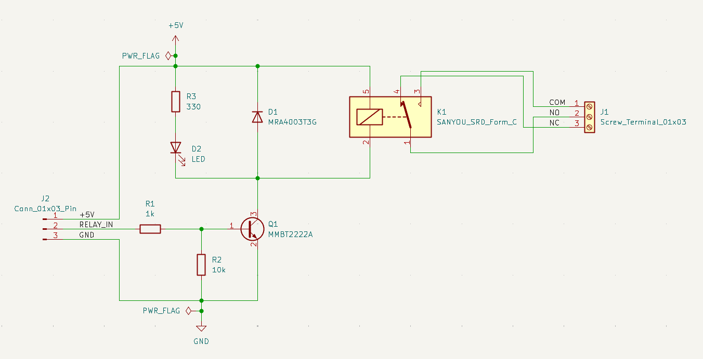
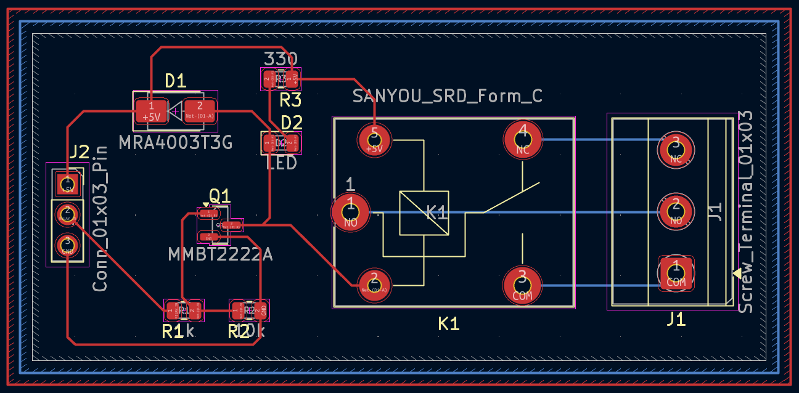
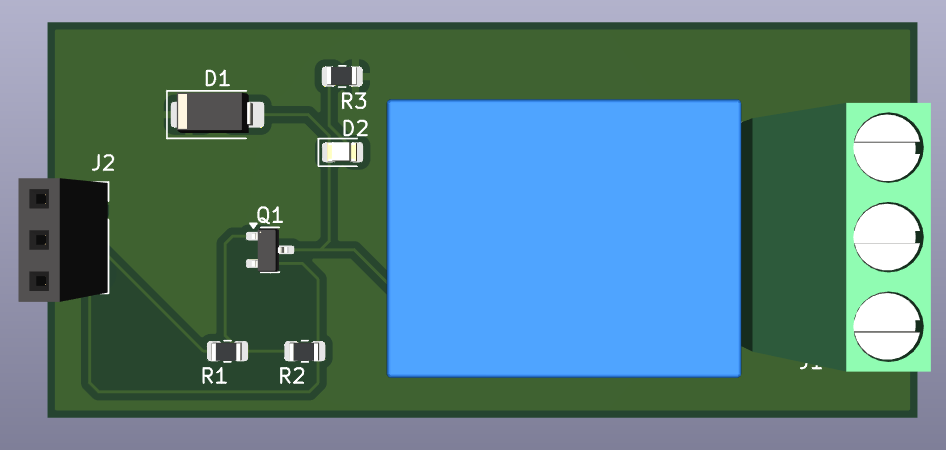
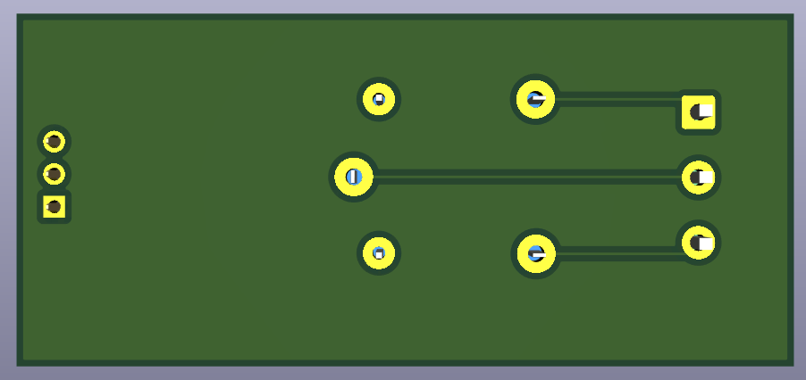

# 03 - Transistor Relay Driver

A beginner-friendly PCB project designed in KiCad 9 to practice driving a relay using a low-current logic/GPIO signal through an NPN transistor switch, with a flyback diode for protection.

Part of my **PCB Design Learning Series**, where I design and document circuits from basic to advanced using KiCad.

## Tools

Designed in **KiCad 9**

## Overview

A relay driver circuit that switches a SANYOU SRD Form-C relay (K1) on and off using a RELAY_IN control signal. Q1 (MMBT2222A) acts as a low-side switch: when RELAY_IN goes high, current flows through R1 into the transistor's base, turning it on and energizing the relay coil. D1 (MRA4003T3G) is a flyback diode across the coil, protecting Q1 from voltage spikes when the relay switches off. D2 is a power/status LED through R3.

The relay itself provides COM, NO (Normally Open), and NC (Normally Closed) contacts on J1, allowing this board to switch an external load independently of the control circuit.

| J2 Pin | Signal     | Description                          |
|--------|------------|----------------------------------------|
| 1      | +5V        | Power input for relay coil & LED      |
| 2      | RELAY_IN   | Control signal, drives Q1 base via R1 |
| 3      | GND        | Common ground                         |

| J1 Pin | Signal | Description                  |
|--------|--------|-------------------------------|
| 1      | COM    | Common relay contact          |
| 2      | NO     | Normally Open contact         |
| 3      | NC     | Normally Closed contact       |

## How It Works

- **RELAY_IN high** → current through R1 into Q1's base → Q1 turns on → completes path through relay coil → K1 energizes → COM connects to NO
- **RELAY_IN low** → Q1 off → coil de-energized → COM returns to NC
- R2 (10k) pulls Q1's base low when RELAY_IN is floating, preventing false triggering
- D1 (flyback diode) suppresses the voltage spike generated when the coil de-energizes, protecting Q1
- D2 + R3 provide a visual power/status indicator

## Features

- Through-hole PCB, beginner-friendly assembly
- NPN transistor (MMBT2222A) as a low-side relay switch
- Flyback diode protection across the relay coil
- Status LED indicator
- ERC and DRC verified
- Gerber and drill files included, ready for fabrication

## Components

| Component               | Qty |
|--------------------------|-----|
| Relay, SRD Form-C (K1)   | 1   |
| NPN Transistor (Q1)      | 1   |
| Flyback Diode (D1)       | 1   |
| LED (D2)                 | 1   |
| 330 Ω Resistor (R3)      | 1   |
| 1k Resistor (R1)         | 1   |
| 10k Resistor (R2)        | 1   |
| 3-Pin Header (J2)        | 1   |
| 3-Pin Screw Terminal (J1)| 1   |

## Repository Contents

- KiCad Schematic
- KiCad PCB
- Gerber Files
- Drill Files
- ERC Report
- DRC Report
- Images

## Images

### Schematic

### PCB Layout

### 3D View

