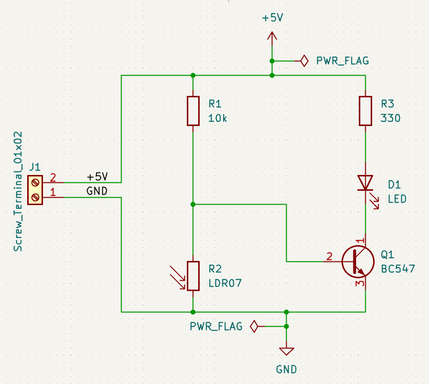
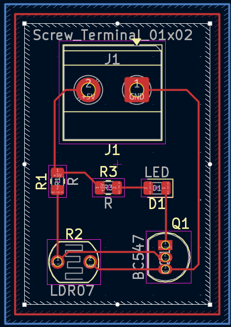
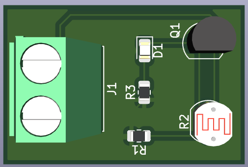
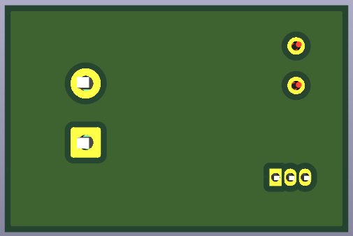

# 04 - LDR Light-Activated LED Circuit

A beginner-friendly PCB project designed in KiCad 9 to practice building a light-sensing circuit using an LDR (light-dependent resistor) in a voltage divider, driving an LED through a transistor switch.

Part of my **PCB Design Learning Series**, where I design and document circuits from basic to advanced using KiCad.

## Software Used

Designed in **KiCad 9**

## Overview

R1 (10k) and R2 (LDR07) form a voltage divider. As ambient light falling on the LDR changes, its resistance changes, which shifts the voltage at the divider's midpoint feeding Q1's base. This turns Q1 on or off, switching the LED (D1) accordingly.

| J1 Pin | Signal | Description        |
|--------|--------|---------------------|
| 1      | GND    | Common ground        |
| 2      | +5V    | Power input          |

## How It Works

- In **darkness**, the LDR's resistance is high, so the divider midpoint voltage rises → Q1 turns on → LED lights up
- In **bright light**, the LDR's resistance drops, pulling the divider midpoint low → Q1 turns off → LED stays off
- R3 (330 Ω) limits current through the LED
- This is a classic dark-activated indicator circuit — the same principle used in automatic night lights

## Features

- Through-hole PCB, beginner-friendly assembly
- LDR-based voltage divider for light sensing
- NPN transistor (BC547) as a switch
- Automatically lights an LED in low-light conditions
- ERC and DRC verified
- Gerber and drill files included, ready for fabrication

## Components

| Component            | Qty |
|------------------------|-----|
| LDR (R2)                | 1   |
| NPN Transistor (Q1)     | 1   |
| LED (D1)                | 1   |
| 330 Ω Resistor (R3)     | 1   |
| 10k Resistor (R1)       | 1   |
| 2-Pin Screw Terminal (J1)| 1  |

## Repository Contents

- KiCad Schematic
- KiCad PCB
- Gerber Files
- Drill Files
- ERC Report
- DRC Report
- Images

## Images

### Schematic

### PCB Layout

### 3D View

