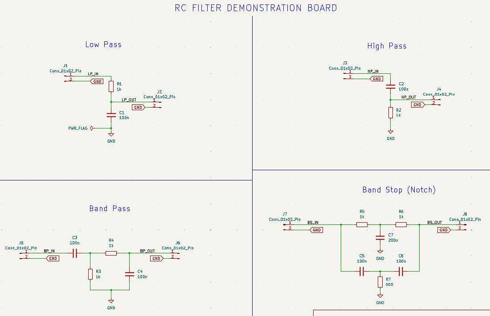
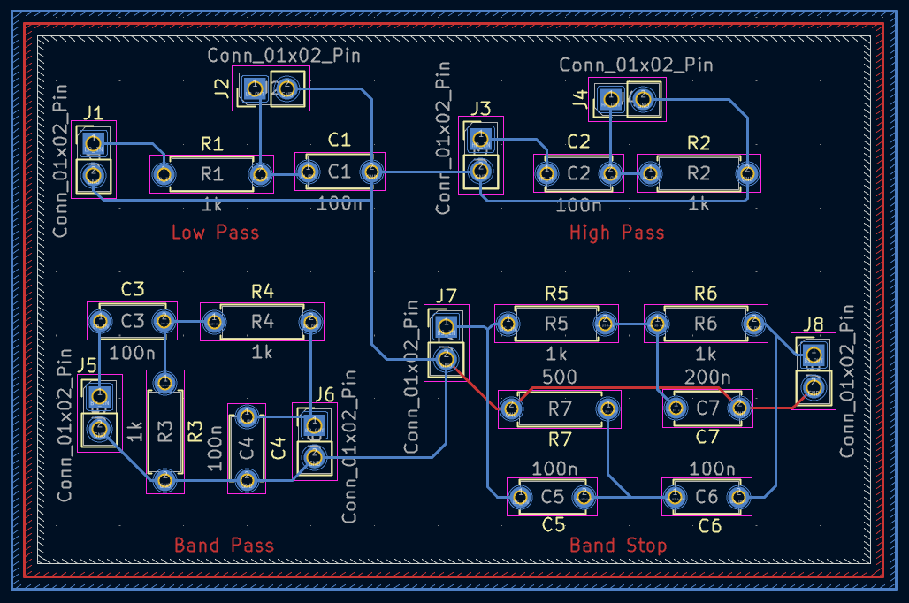
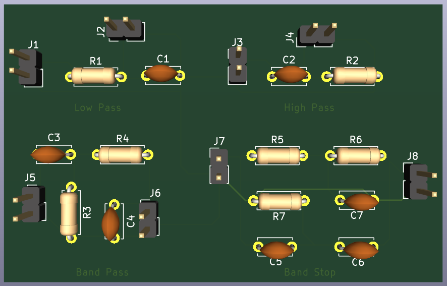
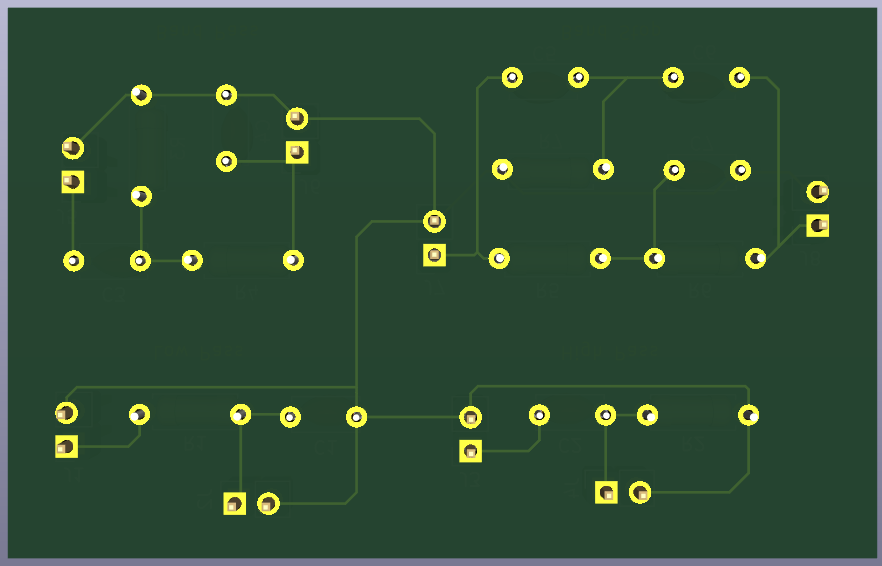

# 07 - RC Filter Demonstration Board

A beginner-friendly PCB project designed in KiCad 9 to practice designing and understanding the four fundamental passive RC filter topologies: low-pass, high-pass, band-pass, and band-stop (notch).

Part of my **PCB Design Learning Series**, where I design and document circuits from basic to advanced using KiCad.

## Software Update

Designed in **KiCad 9**

## Overview

This board combines four independent RC filter circuits on a single PCB, each with its own input/output header, so each filter's behavior can be tested and compared individually.

| Filter          | Input Header | Output Header | Components         |
|------------------|--------------|-----------------|----------------------|
| Low Pass         | J1 (LP_IN)   | J2 (LP_OUT)     | R1 (1k), C1 (100n)  |
| High Pass        | J3 (HP_IN)   | J4 (HP_OUT)     | C2 (100n), R2 (1k)  |
| Band Pass        | J5 (BP_IN)   | J6 (BP_OUT)     | C3 (100n), R4 (1k), R3 (1k), C4 (100n) |
| Band Stop (Notch)| J7 (BS_IN)   | J8 (BS_OUT)     | R5 (1k), R6 (1k), C7 (200n), C5 (100n), C6 (100n), R7 (500) |

## How It Works

- **Low Pass**: R1 and C1 form a simple RC low-pass filter — allows low frequencies through while attenuating high frequencies above the cutoff
- **High Pass**: C2 and R2 form the inverse — attenuates low frequencies, passes high frequencies above the cutoff
- **Band Pass**: combines high-pass and low-pass stages (C3/R3 and R4/C4) to pass only a middle band of frequencies
- **Band Stop (Notch)**: a twin-T style network (R5/R6/C7/C5/C6/R7) that attenuates a specific frequency band while passing frequencies above and below it

Each filter section is fully independent — separate input/output headers mean any one filter can be tested in isolation with a function generator and oscilloscope.

## Features

- Through-hole PCB, beginner-friendly assembly
- 4 independent passive RC filter topologies on one board
- Separate I/O headers per filter for isolated testing
- ERC and DRC verified
- Gerber and drill files included, ready for fabrication

## Components

| Component        | Qty |
|-------------------|-----|
| Resistors (1k)     | 5   |
| Resistor (500 Ω)   | 1   |
| Capacitors (100n)  | 4   |
| Capacitor (200n)   | 1   |
| 2-Pin Headers (J1–J8) | 8 |

## Repository Contents

- KiCad Schematic
- KiCad PCB
- Gerber Files
- Drill Files
- ERC Report
- DRC Report
- Images

## Images

### Schematic

### PCB Layout

### 3D View

