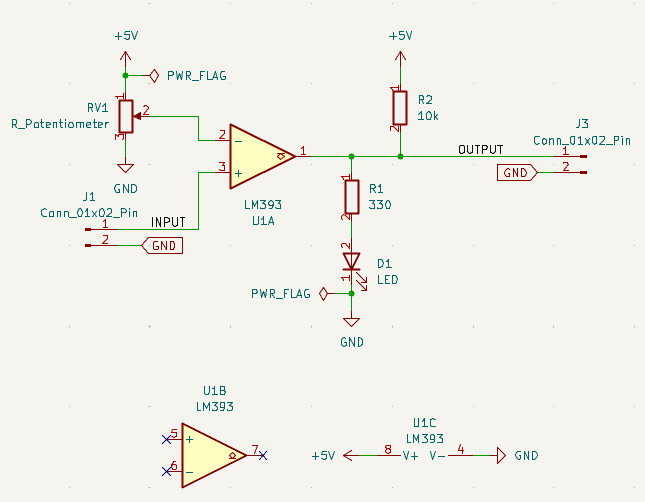
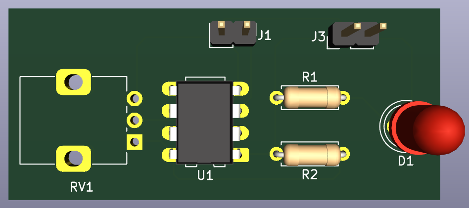
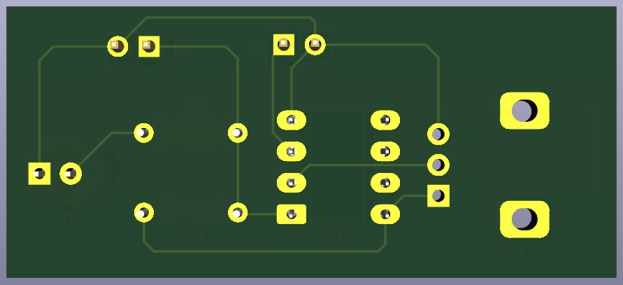

# 09 - LM393 Voltage Comparator Circuit

A beginner-friendly PCB project designed in KiCad 9 to practice building a voltage comparator circuit using the LM393 dual comparator IC, with an adjustable reference threshold and LED output indicator.

Part of my **PCB Design Learning Series**, where I design and document circuits from basic to advanced using KiCad.

## Overview

U1A (one comparator inside the LM393 package) compares an external INPUT signal (pin 2, inverting input) against an adjustable reference voltage set by potentiometer RV1 (pin 3, non-inverting input). Since the LM393 has an open-collector output, R2 (10k) acts as a pull-up resistor on the output line. The output also drives an LED (D1) through R1 (330 Ω) as a visual indicator, and is broken out to J3 for external use.

| J1 Pin | Signal  | Description                          |
|--------|---------|-----------------------------------------|
| 1      | INPUT   | Signal to compare, feeds U1A inverting input (pin 2) |
| 2      | GND     | Common ground                           |

| J3 Pin | Signal  | Description                  |
|--------|---------|---------------------------------|
| 1      | OUTPUT  | Comparator output (open-collector, pulled up by R2) |
| 2      | GND     | Common ground                    |

## How It Works

- RV1 sets an adjustable reference voltage at U1A's non-inverting input (pin 3)
- INPUT (pin 2) is compared against this reference
- If INPUT voltage < reference voltage → comparator output goes high (pulled up by R2) → D1 lights up
- If INPUT voltage > reference voltage → comparator output pulls low → D1 turns off
- R1 (330 Ω) limits current through the LED
- R2 (10k) is required because the LM393's output stage is open-collector — it can only pull low, so an external pull-up resistor is needed to get a high-level output
- U1B and U1C shown in the schematic represent the second unused comparator inside the same LM393 package and its power pins — not used in this circuit

## Features

- Through-hole PCB, beginner-friendly assembly
- Adjustable voltage threshold via potentiometer
- Open-collector comparator output with pull-up resistor
- Visual LED indicator on comparator output state
- ERC and DRC verified
- Gerber and drill files included, ready for fabrication

## Components

| Component               | Qty |
|--------------------------|-----|
| LM393 Comparator (U1)     | 1   |
| Potentiometer (RV1)       | 1   |
| LED (D1)                  | 1   |
| 330 Ω Resistor (R1)       | 1   |
| 10k Resistor (R2)         | 1   |
| 2-Pin Header (J1)         | 1   |
| 2-Pin Header (J3)         | 1   |

## Repository Contents

- KiCad Schematic
- KiCad PCB
- Gerber Files
- Drill Files
- ERC Report
- DRC Report
- Images

## Images

### Schematic

### PCB Layout

### 3D View

## Tools

Designed in **KiCad 9**.
