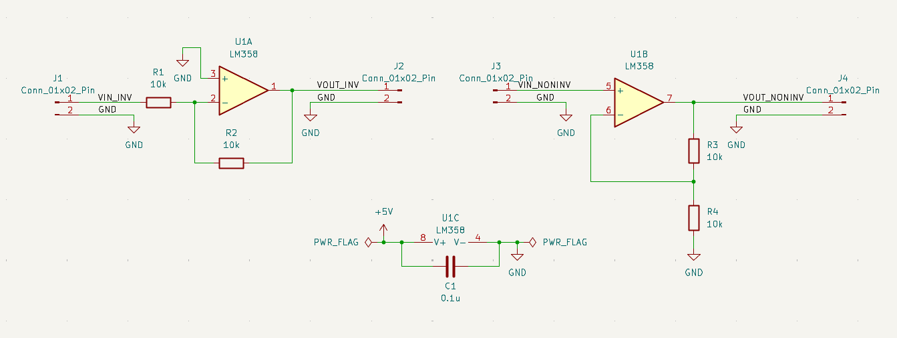
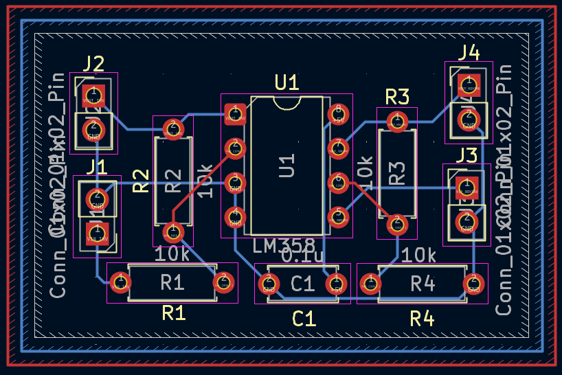
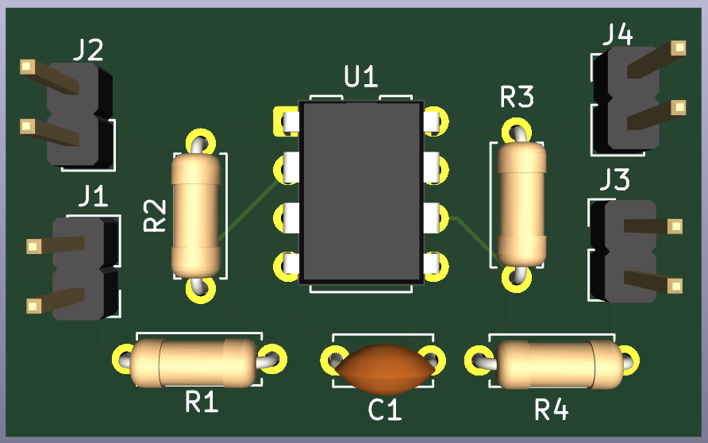
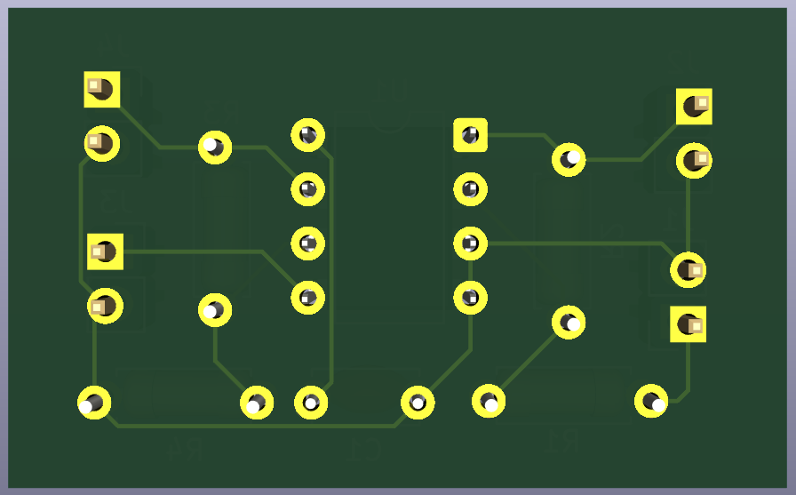

# 10 - LM358 Inverting & Non-Inverting Amplifier Circuits

A beginner-friendly PCB project designed in KiCad 9 to practice building both fundamental op-amp configurations — inverting and non-inverting amplifiers — using the LM358 dual op-amp IC.

Part of my **PCB Design Learning Series**, where I design and document circuits from basic to advanced using KiCad.

## Software Used

Designed in **KiCad 9**

## Overview

This board implements both classic op-amp gain configurations side by side using a single LM358 package:

- **U1A** — configured as an **inverting amplifier** (VIN_INV → VOUT_INV)
- **U1B** — configured as a **non-inverting amplifier** (VIN_NONINV → VOUT_NONINV)

U1C represents the LM358's power pins, decoupled with C1 (0.1 µF).

| J1 Pin | Signal    | Description                        |
|--------|-----------|---------------------------------------|
| 1      | VIN_INV   | Input to inverting amplifier stage    |
| 2      | GND       | Common ground                         |

| J2 Pin | Signal     | Description                    |
|--------|------------|-----------------------------------|
| 1      | VOUT_INV   | Output of inverting amplifier stage |
| 2      | GND        | Common ground                    |

| J3 Pin | Signal        | Description                        |
|--------|----------------|---------------------------------------|
| 1      | VIN_NONINV     | Input to non-inverting amplifier stage |
| 2      | GND            | Common ground                          |

| J4 Pin | Signal         | Description                        |
|--------|-----------------|---------------------------------------|
| 1      | VOUT_NONINV     | Output of non-inverting amplifier stage |
| 2      | GND             | Common ground                          |

## How It Works

**Inverting Amplifier (U1A):**
- Input signal (VIN_INV) feeds through R1 (10k) into the inverting input (pin 2)
- R2 (10k) provides feedback from output to inverting input
- Gain = −R2/R1 = **−1** (unity gain, inverted output)
- Non-inverting input (pin 3) is tied to GND as the reference

**Non-Inverting Amplifier (U1B):**
- Input signal (VIN_NONINV) feeds directly into the non-inverting input (pin 5)
- R3 and R4 (both 10k) form a feedback voltage divider from output back to the inverting input (pin 6)
- Gain = 1 + (R3/R4) = **2** (output is in-phase with input, doubled in amplitude)

**Power:**
- C1 (0.1 µF) decouples the LM358's supply pins (V+ / V−) to reduce noise

## Features

- Through-hole PCB, beginner-friendly assembly
- Both inverting and non-inverting op-amp configurations on one board
- Independent I/O headers per amplifier stage for isolated testing
- Power supply decoupling capacitor
- ERC and DRC verified
- Gerber and drill files included, ready for fabrication

## Components

| Component            | Qty |
|------------------------|-----|
| LM358 Dual Op-Amp (U1)  | 1   |
| 10k Resistors (R1–R4)   | 4   |
| 0.1 µF Capacitor (C1)   | 1   |
| 2-Pin Headers (J1–J4)   | 4   |

## Repository Contents

- KiCad Schematic
- KiCad PCB
- Gerber Files
- Drill Files
- ERC Report
- DRC Report
- Images

## Images

### Schematic

### PCB Layout

### 3D View

