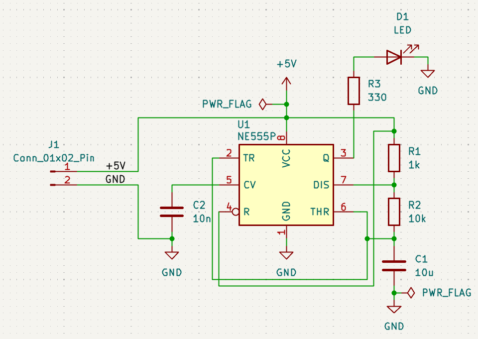
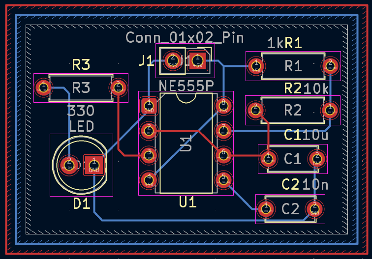
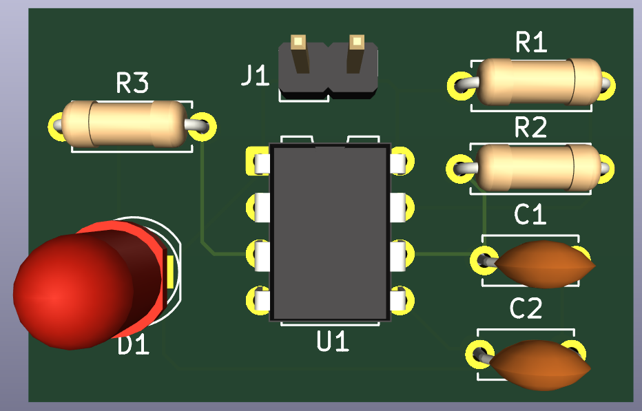
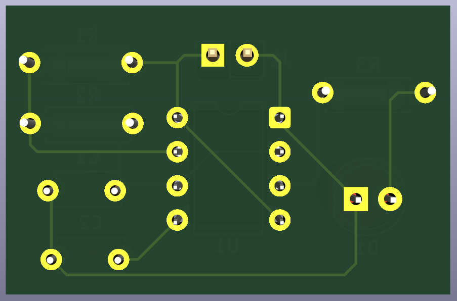

# 11 - NE555 Astable LED Blinker

A beginner-friendly PCB project designed in KiCad 9 to practice building a classic 555 timer astable (free-running oscillator) circuit that blinks an LED at a fixed rate.

Part of my **PCB Design Learning Series**, where I design and document circuits from basic to advanced using KiCad.

## Software Used

Designed in **KiCad 9**

## Overview

U1 (NE555P) is configured in astable mode, continuously charging and discharging C1 through R1 and R2 to generate a repeating square wave at the output (pin 3). This output drives an LED (D1) through current-limiting resistor R3, causing it to blink at a steady rate.

| J1 Pin | Signal | Description        |
|--------|--------|---------------------|
| 1      | +5V    | Power input          |
| 2      | GND    | Common ground        |

## How It Works

- C1 (10 µF) charges through R1 (1k) and R2 (10k) in series, and discharges through R2 alone via the DIS pin (pin 7)
- This charge/discharge cycle sets the timing of the output square wave at pin 3 (Q)
- When output is high, D1 lights up through R3 (330 Ω); when low, D1 turns off
- C2 (10n) on the CV pin (pin 5) stabilizes the internal reference voltage against noise
- Pin 4 (R, reset) is tied high to keep the timer continuously running
- Approximate blink frequency: **f ≈ 1.44 / ((R1 + 2×R2) × C1)**

## Features

- Through-hole PCB, beginner-friendly assembly
- Classic NE555 astable oscillator configuration
- Blinking LED output with current-limiting resistor
- Noise-stabilizing control voltage capacitor
- ERC and DRC verified
- Gerber and drill files included, ready for fabrication

## Components

| Component             | Qty |
|--------------------------|-----|
| NE555P Timer IC (U1)     | 1   |
| LED (D1)                 | 1   |
| 330 Ω Resistor (R3)      | 1   |
| 1k Resistor (R1)         | 1   |
| 10k Resistor (R2)        | 1   |
| 10 µF Capacitor (C1)     | 1   |
| 10n Capacitor (C2)       | 1   |
| 2-Pin Header (J1)        | 1   |

## Repository Contents

- KiCad Schematic
- KiCad PCB
- Gerber Files
- Drill Files
- ERC Report
- DRC Report
- Images

## Images

### Schematic

### PCB Layout

### 3D View

