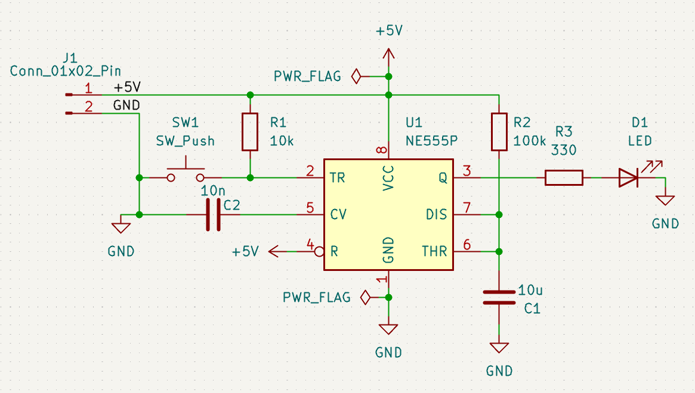
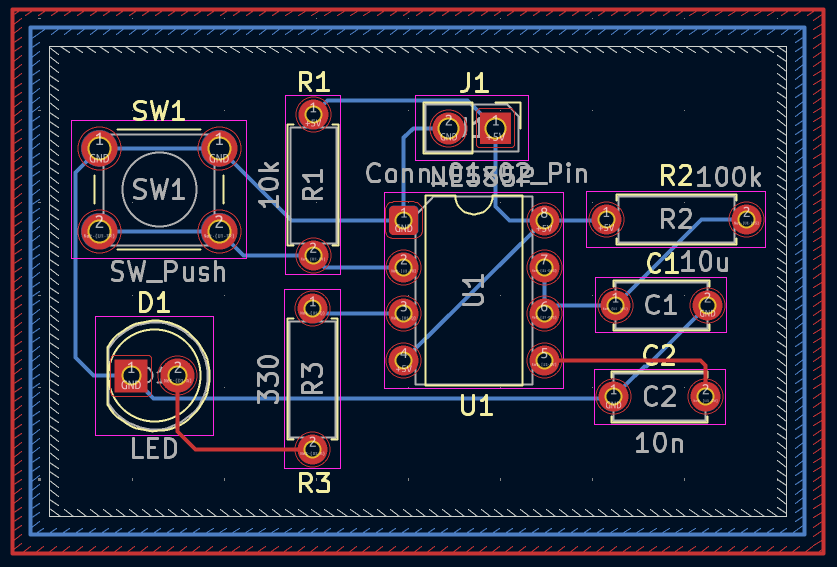
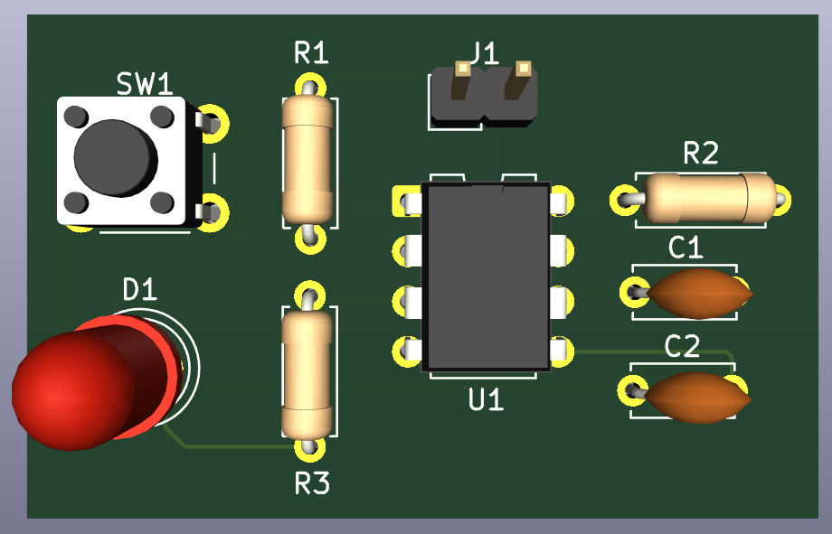
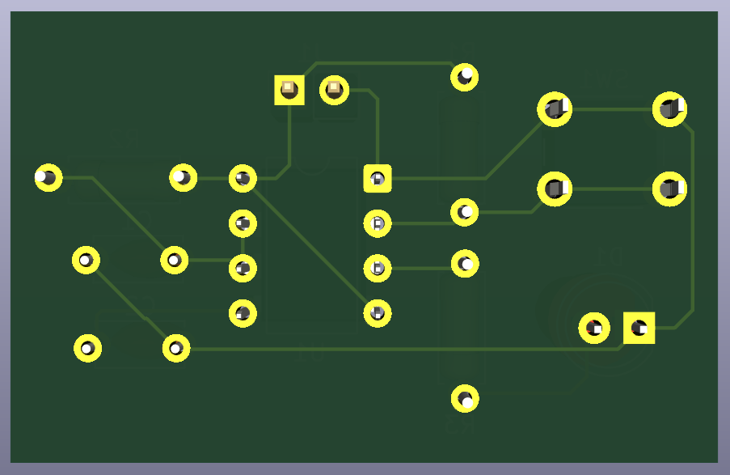

# 12 - NE555 Monostable Push-Button Timer

A beginner-friendly PCB project designed in KiCad 9 to practice building a 555 timer monostable ("one-shot") circuit, where pressing a push button lights an LED for a fixed duration.

Part of my **PCB Design Learning Series**, where I design and document circuits from basic to advanced using KiCad.

## Software Used

Designed in **KiCad 9**

## Overview

U1 (NE555P) is configured in monostable mode. Pressing SW1 momentarily pulls the TRIGGER pin (pin 2) low, starting a single timing cycle. During this cycle, the output (pin 3) goes high, lighting LED D1 through current-limiting resistor R3. After the timing period set by R2 and C1 elapses, the output returns low and the LED turns off — until the button is pressed again.

| J1 Pin | Signal | Description        |
|--------|--------|---------------------|
| 1      | +5V    | Power input          |
| 2      | GND    | Common ground        |

## How It Works

- R1 (10k) pulls the TRIGGER pin (pin 2) high when SW1 is not pressed, keeping the timer idle
- Pressing SW1 momentarily connects TRIGGER to GND, dropping it below 1/3 VCC and starting the timing cycle
- Once triggered, the output (pin 3, Q) goes high regardless of further trigger changes, lighting D1 through R3 (330 Ω)
- R2 (100k) and C1 (10 µF) set the output pulse duration, charging until the THRESHOLD pin (pin 6) reaches 2/3 VCC, at which point the output resets low and D1 turns off
- C2 (10n) on the CV pin (pin 5) stabilizes the internal reference voltage against noise
- Approximate pulse duration: **t ≈ 1.1 × R2 × C1**

## Features

- Through-hole PCB, beginner-friendly assembly
- Push-button triggered NE555 monostable (one-shot) timer
- LED lights for a fixed, predictable duration per button press
- Noise-stabilizing control voltage capacitor
- ERC and DRC verified
- Gerber and drill files included, ready for fabrication

## Components

| Component             | Qty |
|--------------------------|-----|
| NE555P Timer IC (U1)     | 1   |
| Push Button (SW1)        | 1   |
| LED (D1)                 | 1   |
| 330 Ω Resistor (R3)      | 1   |
| 10k Resistor (R1)        | 1   |
| 100k Resistor (R2)       | 1   |
| 10 µF Capacitor (C1)     | 1   |
| 10n Capacitor (C2)       | 1   |
| 2-Pin Header (J1)        | 1   |

## Repository Contents

- KiCad Schematic
- KiCad PCB
- Gerber Files
- Drill Files
- ERC Report
- DRC Report
- Images

## Images

### Schematic

### PCB Layout

### 3D View

